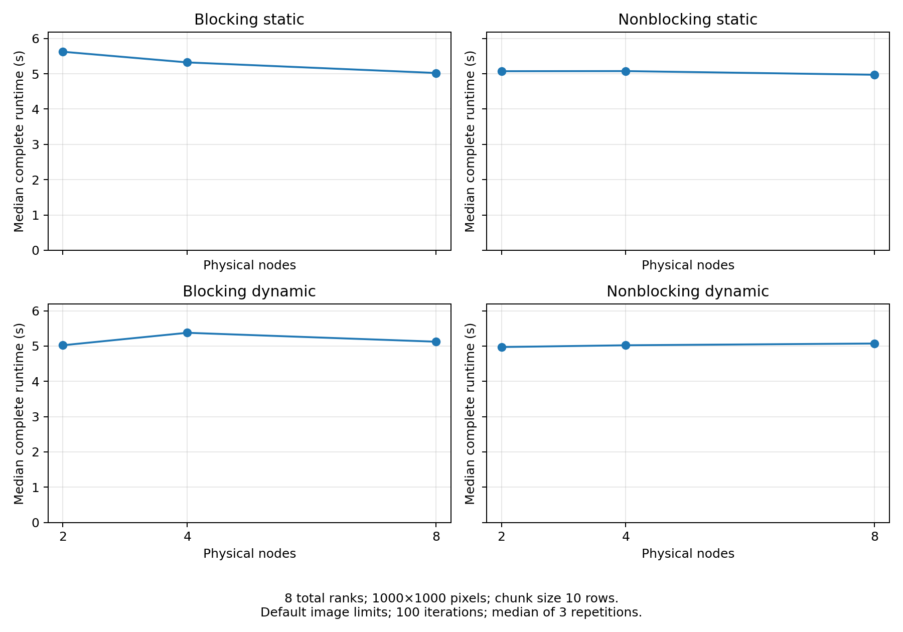
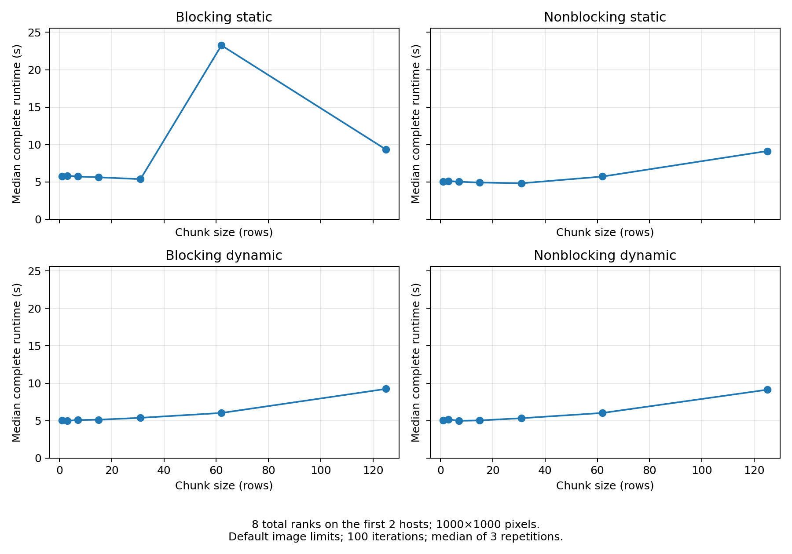
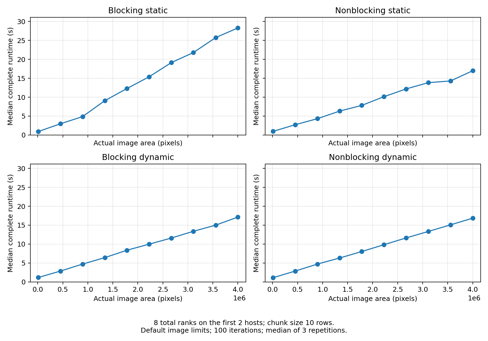

# 02616 Large Scale Modeling — Mandelbrot project

Group workspace for Project 1: compare four MPI implementations of the Mandelbrot
calculation using static/dynamic scheduling and blocking/nonblocking communication.
The initial experiment suite has run successfully: **240 measurements**, with
three repetitions per configuration, and three figures exported as PNG and PDF.

## Start here

```sh
git clone https://github.com/mathiaskrois/02616_LargeScaleModeling.git
cd 02616_LargeScaleModeling
```

The project files are in `Week05/`. Read [the assignment](Week05/Project.tex) and
[the experiment design](Week05/EXPERIMENTS.md), then use the saved results for analysis.

| Implementation | Source |
|---|---|
| Blocking static | [Mandelbrot_blocking_static.py](Week05/Mandelbrot_blocking_static.py) |
| Nonblocking static | [Mandelbrot_nonblocking_static.py](Week05/Mandelbrot_nonblocking_static.py) |
| Blocking dynamic | [Mandelbrot_blocking_dynamic.py](Week05/Mandelbrot_blocking_dynamic.py) |
| Nonblocking dynamic | [Mandelbrot_nonblocking_dynamic.py](Week05/Mandelbrot_nonblocking_dynamic.py) |

[Mandelbrot.py](Week05/Mandelbrot.py) is the serial course reference. The static
implementations assign chunks cyclically in advance; the dynamic implementations
use rank zero to manage work for seven workers when running with eight ranks.
All preserve the original argument order and use 100 iterations.

## Heavier follow-up suite

The current configuration increases the node/chunk image to **3000×3000** and the
area sweep maximum to **6000×6000**. Both contain nine times as many pixels as the
corresponding initial sizes. The changes will be pushed before submitting the new
HPC job; its measurements will be saved under a new job ID. Job 29611697 below
continues to describe the initial, smaller experiment.

| Sweep | Values | Fixed settings |
|---|---|---|
| Physical nodes | 2, 4, 8 | 8 ranks; 3000×3000 image; chunk size 10 |
| Chunk size (rows) | 3, 11, 23, 46, 93, 187, 375 | 8 ranks on 2 hosts; 3000×3000 image |
| Image side (pixels) | 1000, 2211, 2963, 3559, 4069, 4522, 4933, 5312, 5667, 6000 | 8 ranks on 2 hosts; chunk size 10 |

The chunk sweep retains the previous formula, now using 3000 rows:
`max(1, floor(3000 / (8*x)))`, for `x = [125, 32, 16, 8, 4, 2, 1]`.
The area sweep uses ten equally spaced target areas from 1,000,000 to 36,000,000
pixels, rounding each square root to obtain a square side. Both target and actual
areas are saved; figures use actual area.

There are still **240 measured runs**: four implementations, 80 configurations,
three shuffled repetition rounds. The algorithms, limits, 100 iterations, eight
ranks, placement, seed and 12-hour allocation are unchanged. LSF can now choose
any CPU model, with the `hpc` queue’s `same[type:model]` policy and runtime probes
ensuring that all eight allocated hosts have exactly the same CPU model. Every
probe, pilot and measured command executes sequentially within this single
allocation. The host list and detected model are saved in metadata. Node tests
select the first 2, 4 or 8 hosts; all chunk and area tests use the same first two. Larger images reduce
MPI startup's fraction of complete runtime; they do not guarantee wider differences
between algorithms. The comparison should be based on the resulting measurements.

The selected CPU may differ from the initial E5-2660 v3 run. Compare algorithms
within each suite; differences between the initial and follow-up suites may
reflect both image size and hardware. A model change does not guarantee a fix
for the earlier MPI launcher crash; placement probes remain mandatory.

Pilots now use **100×100 and 3000×3000** for each implementation. The duration
estimate separates a nonnegative startup cost from an area-dependent compute cost,
then applies the factor-of-two allowance. The runner stops before measurements
if that estimate exceeds the remaining budget. It reserves five minutes for
analysis. Current captions come from each run's saved configuration, so plotting
the initial results still uses the original dimensions.

## Completed results

The completed run is **LSF job 29611697**, performed on October 6, 2026 with eight
allocated Xeon E5-2660 v3 hosts. Its metadata records `"status": "complete"`.

- [Raw measurements](Week05/results/job_29611697/measurements.csv): 240 successful records.
- [Run metadata](Week05/results/job_29611697/metadata.json): host placement, modules,
  versions, source hashes, pilot timings, configuration and commands.
- [Configuration used](Week05/results/job_29611697/experiments.yaml).
- [Source snapshots](Week05/results/job_29611697/sources/) and
  [individual run logs](Week05/results/job_29611697/logs/).
- [Batch stdout](Week05/results/job_29611697/batch.out) and
  [batch stderr](Week05/results/job_29611697/batch.err).

The snapshots retain the exact measured sources, including the original job
paths. The current batch scripts also support each group member's checkout path.
Absolute paths in historical metadata describe the original HPC run; commands
below use the local checkout.

| Sweep | Values | Fixed settings |
|---|---|---|
| Physical nodes | 2, 4, 8 | 8 ranks; 1000×1000 image; chunk size 10 |
| Chunk size (rows) | 1, 3, 7, 15, 31, 62, 125 | 8 ranks on 2 hosts; 1000×1000 image |
| Image side (pixels) | 100, 673, 947, 1158, 1335, 1492, 1634, 1764, 1886, 2000 | 8 ranks on 2 hosts; chunk size 10 |

All sweeps run all four implementations, with default limits `-2.2:0.75` and
`-1.3:1.3`. Image sizes come from equally spaced target areas; plots use actual
pixel areas. Complete runtime includes MPI launch, Python imports, calculation,
communication and finalization. Queue waiting, pilots and analysis are excluded.
The median is calculated from three repetitions; configurations are shuffled
within each repetition round using seed 261605.

For the baseline of 8 ranks on 2 hosts, 1000×1000 pixels and chunk size 10,
the node sweep measured these median complete runtimes:

| Implementation | Median runtime (s) |
|---|---:|
| Blocking static | 5.624 |
| Nonblocking static | 5.072 |
| Blocking dynamic | 5.022 |
| Nonblocking dynamic | 4.972 |

These measurements describe this allocation; shared-host load can affect runtime.
Use the complete sweeps and their logs to support the report's explanations.

### Figures

Each figure uses the same 2×2 order: blocking static, nonblocking static,
blocking dynamic, nonblocking dynamic.



[Nodes PDF](Week05/results/job_29611697/figures/nodes.pdf)



[Chunk size PDF](Week05/results/job_29611697/figures/chunk_size.pdf)



[Image area PDF](Week05/results/job_29611697/figures/image_area.pdf)

## Replot saved data or run tests locally

Use Python 3.12 with an MPI installation available for `mpi4py`. For plotting and
experiment-tool tests alone, only NumPy, Matplotlib and six are needed; the
analysis does not launch MPI or import mpi4py.

```sh
python3 -m venv .venv
source .venv/bin/activate
python3 -m pip install -r requirements.txt
cd Week05
python3 -m unittest -v test_experiments
python3 run_experiments.py --dry-run
python3 plot_experiments.py results/job_29611697 --output-dir figures_local
```

The dry run expands the exact 240-command measurement grid without running it.
Ten acceptance tests check the grid, placement guards, pilot estimates, known
medians, rejection of invalid data, failure recording, historical-data compatibility, rejection of mixed CPU models and plot exports.
Plotting rejects failed, duplicate, off-grid or incomplete data.
`experiments.yaml` uses JSON syntax, which is also valid YAML, so PyYAML is unnecessary.
The bundled `vendor/six.py` supplies a fallback for the cluster Matplotlib module.

## Run a new suite on DTU HPC

Submit from the checkout's `Week05` directory. Load the same cluster modules for
local dry runs or plotting:

```sh
cd Week05
module load numpy/2.3.1-python-3.12.11-openblas-0.3.30
module load mpi4py/4.0.3-python-3.12.11-openmpi-5.0.8
module load matplotlib/3.10.3-numpy-2.3.1-python-3.12.11
export OMP_NUM_THREADS=1 OPENBLAS_NUM_THREADS=1 MPLBACKEND=Agg
python3 run_experiments.py --dry-run
export EXPERIMENT_WORK_DIR="$PWD"
bsub < experiments_job.sh
```

The batch script loads its modules too. It reserves 32 slots, four per host,
1 GB per slot, for up to 12 hours on the `hpc` queue. All eight hosts must use
one CPU model, selected by LSF; there is no fixed-model restriction. The queue
enforces `same[type:model]`; DTU’s submission filter rejects adding `same[...]`
as a user resource directive, so the script relies on that queue policy and
verifies exact model equality in the probes. Only that script is submitted;
the experiment runner executes commands sequentially in the one allocation.
Do not run MPI benchmarks on the login host.

Before timing, the runner checks all three placements and core binding, then runs
each implementation at 100×100 and the configured 3000×3000 baseline. It stops before measurements if the
pilot estimate with a factor-of-two allowance exceeds the remaining time budget.
Each measured attempt is logged immediately; a failure stops the suite.

The batch command prints the new job ID. Monitor it using:

```sh
bjobs JOBID
tail -f mandelbrot_experiments_JOBID.out
```

`PEND` means queued, `RUN` means running, `DONE` means successful completion, and
`EXIT` means a failure. The results go to `results/job_JOBID/`. Completion is
confirmed by `metadata.json` recording `"status": "complete"`, with 240 successful
records and all six figure exports. On failure, inspect its `error` and the
associated stdout/stderr logs before rerunning.

## Working as a group

Create a branch for each change and open a pull request for teammates to review:

```sh
git pull --ff-only
git switch -c yourname/change-description
# Edit the project or add report analysis.
git add <changed-files>
git commit -m "Describe the change"
git push -u origin yourname/change-description
```

Keep the completed run as the baseline. Store additional runs in new job directories
so code changes and measurements remain traceable. Virtual environments, Python
caches and top-level scheduler logs are ignored; the completed run's archived logs
and figures are intentionally tracked.

The agreed node sweep covers **2, 4 and 8 hosts**. The assignment also asks for a
one-node versus multiple-node comparison; that remains a separate experiment to
plan. The report should explain the observed performance, document the scheduling
and code changes, and use labelled figures with captions.

## Source credit

The serial reference, assignment and course framing originate from the
[02616 student course repository](https://gitlab.gbar.dtu.dk/dcc-teaching/02616/02616-student).
The MPI programs and experiment tooling form this group's project work.
`Week05/vendor/six.py` retains its original license header.
